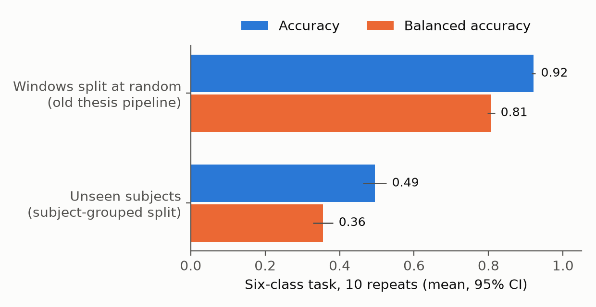
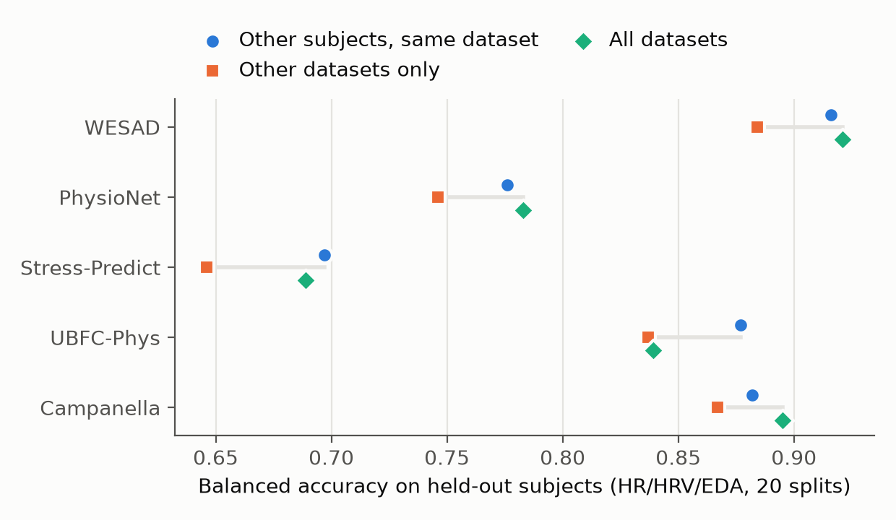
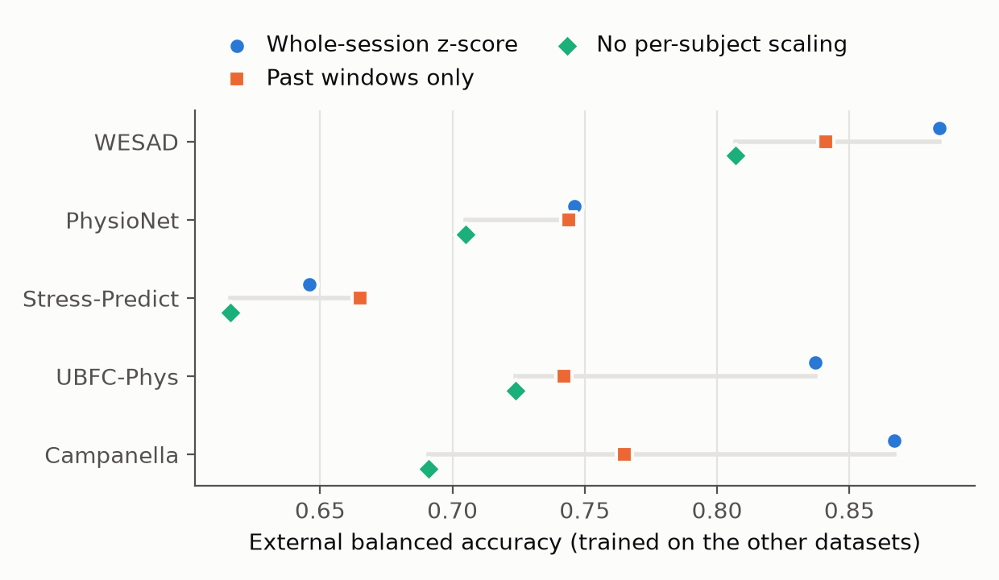
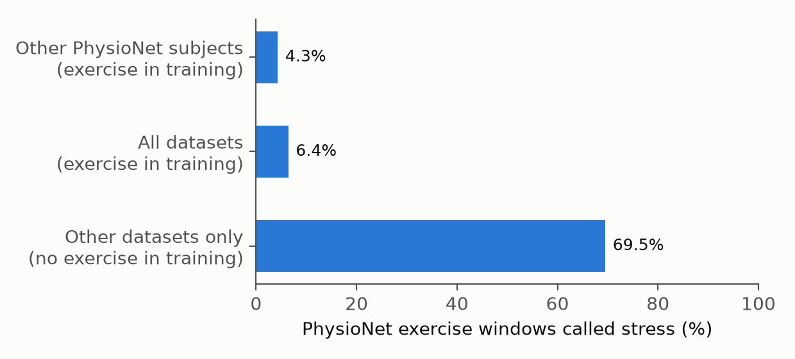
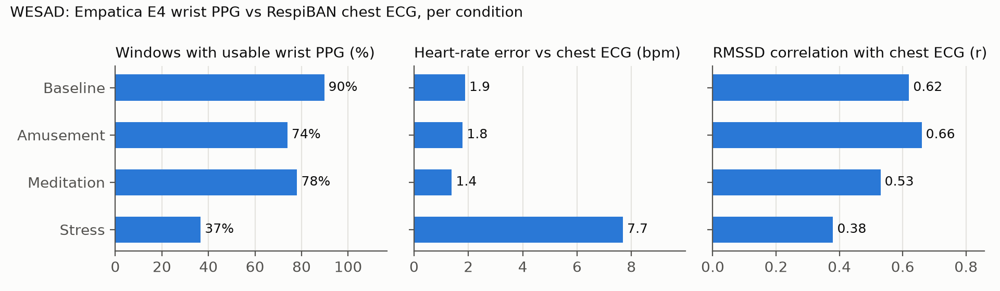
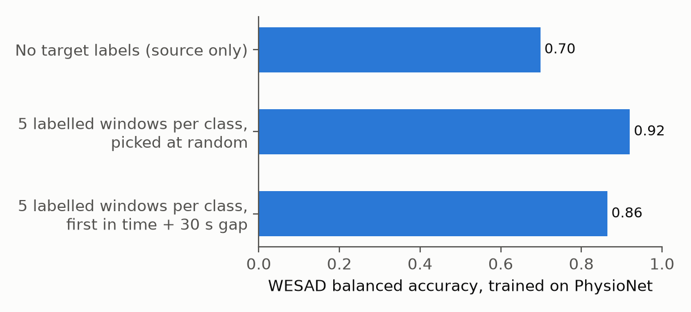

# Wrist-wearable stress detection across datasets

Stress detection from the Empatica E4 wristband (heart rate and HRV from wrist PPG, electrodermal activity, skin temperature), evaluated across five public datasets. The pipeline, results and literature review here form the working copy for a journal revision (IEEE JBHI).

> **The numbers in earlier versions of this README were wrong.** The old headline of "94.53% accuracy, 96 subjects" came from a window-level train/test split that put the same people on both sides. On unseen subjects the same six-class model scores 49% accuracy (balanced accuracy 0.36). The old notebooks, models and figures are kept in [`legacy/`](legacy/) for reference only. Do not cite them.

## What the pipeline does

- **Data.** Empatica E4 recordings from five public stress datasets (132 subjects), plus EPM-E4 for emotion windows.
  - WESAD (15 subjects)
  - PhysioNet wearable stress/exercise dataset (Hongn et al. 2025; 35)
  - Stress-Predict (34)
  - UBFC-Phys (19)
  - Campanella et al. 2024 (29)
- **Windows.** 60 s windows at a 30 s step, each lying inside one protocol stage. Labels follow the audited protocol timings (see [Label audit](#label-audit)).
- **Features.**
  - Heart rate and HRV from wrist PPG (NeuroKit2, artefact rejection).
  - EDA tonic/phasic features.
  - Skin temperature and accelerometer.
  - The main feature set is **HR/HRV + EDA**. UBFC-Phys released no temperature, and temperature mostly tracks time in session.
- **Task.** Stress vs **all** non-stress states (baseline, rest, meditation, amusement). Baseline-vs-stress alone is confounded with time in session, because baseline is always recorded first.
- **Evaluation.**
  - Subjects are never split across train and test.
  - 20 repeated subject-grouped splits, plus leave-one-subject-out.
  - Nested hyper-parameter tuning.
  - Nadeau–Bengio corrected t-tests with Holm correction.
  - Balanced accuracy as the main metric.

## Key results

All numbers come from the tables in [`outputs/tables/jbhi_v2/`](outputs/tables/jbhi_v2/). All figures are drawn from those tables by `scripts/make_figures.py`.

### 1. Splitting by window instead of by subject inflates accuracy

| Split (six-class task, 10 repeats) | Accuracy | Balanced accuracy |
|---|---|---|
| Random 15% of windows (old thesis pipeline) | 0.921 | 0.807 |
| 15% of subjects held out | **0.494** | **0.355** |



### 2. Transfer to an unseen dataset costs little

**Setup.** Leave-one-dataset-out, stress vs all non-stress, per-subject z-scored HR/HRV + EDA, XGBoost, 20 splits of the same test subjects. **External** means the model saw no data from the test dataset.

| Test dataset | Other subjects, same dataset | Other datasets only (external) | Cost |
|---|---|---|---|
| WESAD | 0.916 | 0.884 | 0.032 |
| PhysioNet | 0.776 | 0.746 | 0.030 |
| Stress-Predict | 0.697 | 0.646 | 0.051 |
| UBFC-Phys | 0.877 | 0.837 | 0.040 |
| Campanella | 0.882 | 0.867 | 0.015 |



**Caveats.**
- **Exercise.** A model trained without exercise data calls 69.5% of PhysioNet's exercise windows stress, and external balanced accuracy falls to 0.583 (see result 4). The small transfer cost holds for seated and lab non-stress states only.
- **Normalisation.** Whole-session per-subject z-scoring uses the test subject's unlabelled windows. See result 3 for variants that don't.
- **UBFC-Phys.** With all physiology features (temperature included), UBFC-Phys drops to 0.589 externally even though AUROC stays at 0.931. Its missing temperature channel shifts the decision threshold. Dropping temperature fixes it.

### 3. The small cost does not depend on whole-session scaling

External balanced accuracy (trained on the other datasets) under three per-subject scaling choices:

| Test dataset | Whole-session z-score | Past windows only (deployable) | No scaling |
|---|---|---|---|
| WESAD | 0.884 | 0.841 | 0.807 |
| PhysioNet | 0.746 | 0.744 | 0.705 |
| Stress-Predict | 0.646 | 0.665 | 0.616 |
| UBFC-Phys | 0.837 | 0.742 | 0.724 |
| Campanella | 0.867 | 0.765 | 0.691 |

- **Cost stays small without scaling.** Without any per-subject scaling the transfer cost stays between −0.01 and 0.05, but absolute accuracy is lower.
- **Past-windows scaling.** It matches whole-session scaling on long recordings. It loses about 0.10 on the short Campanella and UBFC-Phys recordings.
- **Details.** [`docs/novelty_experiments.md`](docs/novelty_experiments.md).



### 4. Exercise is mistaken for stress unless it is in the training data



### 5. Wrist heart rate is accurate; wrist HRV is weak, especially under stress

On WESAD, Empatica E4 wrist PPG was compared with the chest ECG (RespiBAN), window by window:
- **Heart rate:** MAE 2.4 bpm, r = 0.94.
- **RMSSD:** r = 0.53, reading 34 ms high.
- **Usable PPG:** only 37% of stress windows keep usable PPG, because speaking moves the wrist.



### 6. A few labelled windows from a new person help, even when chosen honestly

**Setup.** Train on PhysioNet, test on WESAD, then fine-tune with 5 labelled windows per class from each WESAD subject.

- **Honest selection:** taking the first windows in time, with a 30 s gap before the test windows, reaches 0.86 balanced accuracy.
- **Random selection:** reaches 0.92, but neighbouring windows overlap, so part of that gain is leakage.
- **Scope:** WESAD only. PhysioNet subjects have too few baseline windows to evaluate this.



### Other results

- **Pooled baseline vs stress** (WESAD + PhysioNet, 50 subjects), all modalities, XGBoost:
  - 0.831 balanced accuracy over 20 subject-grouped splits (95% CI 0.813–0.850);
  - 0.849 under leave-one-subject-out.
- **Tuned models tie.** On that task, XGBoost, random forest and MLP are within 0.004 of each other, and no paired difference is significant.
- **Domain adaptation.** CORAL, MMD, DANN and subject-adversarial DANN give no consistent gain over source-only training (tested WESAD↔PhysioNet only).

## Label audit

The dataset descriptor papers were read in full, and seven label problems were fixed in commit `6070b6b`:
- Stress-Predict subject S01 dropped;
- stage boundaries snapped to E4 tags;
- Campanella's open-ended subtraction task ended per subject;
- PhysioNet subject f13 excluded;
- plus two sensitivity switches.

External accuracy rose on every dataset. Most of those gains, however, are within split noise: only WESAD external AUROC improves significantly after Holm correction. Details: [`docs/literature/dataset-and-claims-verification.md`](docs/literature/dataset-and-claims-verification.md).

## Reproduce

The raw datasets are not in this repo (licences). Download them from their providers, then:

```bash
pip install -r requirements.txt

# 1. Feature windows from raw signals (writes the harmonised table)
python scripts/extract_features.py --data-root /path/to/datasets --output /path/to/harmonized_windows_v2.csv

# 2. Main experiments
python scripts/leave_one_dataset_out.py --input /path/to/harmonized_windows_v2.csv
python scripts/run_jbhi_experiments.py --input /path/to/harmonized_windows_v2_three_datasets_fixed.csv
python scripts/validate_cardiac_against_ecg.py --data-root /path/to/datasets
python scripts/domain_adaptation.py --input /path/to/harmonized_windows_v2.csv --support chronological --gap 30

# 3. Sensitivity checks from the novelty search (normalisation, exercise, Kwon et al. setting)
python scripts/leave_one_dataset_out.py --input /path/to/harmonized_windows_v2.csv \
    --output-dir outputs/tables/jbhi_v2/novelty_experiments --normalisation causal --tag _causal
python scripts/novelty_experiments_summary.py

# 4. Figures (needs only the committed tables)
python scripts/make_figures.py

# Tests
pytest tests
```

Note: `run_jbhi_experiments.py` is meant for the three-dataset table (WESAD, PhysioNet, EPM-E4). On all six datasets its tasks change and it takes hours.

## Repository layout

```
scripts/                     feature extraction, relabelling, evaluation, tuning, transfer and figure scripts
tests/                       pytest checks for splits, relabelling, normalisation and few-shot support selection
outputs/tables/jbhi_v2/      current results (CSV)
outputs/figures/jbhi_v2/     current figures (PNG + PDF), drawn by scripts/make_figures.py
docs/literature/             full-text literature verification and novelty search
docs/novelty_experiments.md  sensitivity experiments prompted by the novelty search
legacy/                      old notebooks, models, figures and tables from the leaky thesis pipeline (not valid results)
```

## Literature

- [`docs/literature/novelty-search.md`](docs/literature/novelty-search.md): what is and is not new relative to published work.
  - Closest prior work is Kwon et al. (2026): leave-one-dataset-out on three E4 datasets.
  - AutoStress (2026) pools three datasets but holds none out.
- [`docs/literature/dataset-and-claims-verification.md`](docs/literature/dataset-and-claims-verification.md): full-text checks of every dataset descriptor and cited claim.

## License

Research use only. Each dataset keeps its own licence; see the providers.
